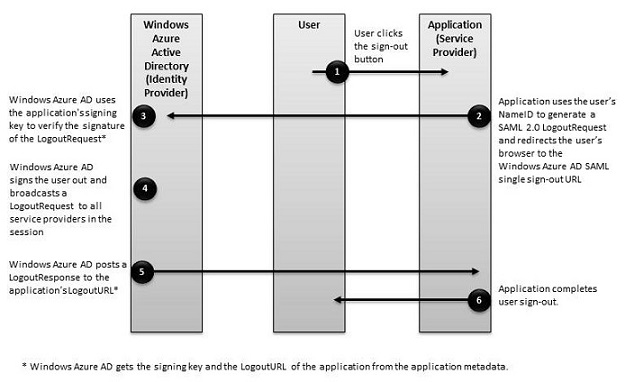

<properties
	pageTitle="Azure Single Sign Out SAML Protocol | Microsoft Azure"
	description="This article describes the Single Sign-Out SAML Protocol in Azure Active Directory"
	services="active-directory"
	documentationCenter=".net"
	authors="priyamohanram"
	manager="mbaldwin"
	editor=""/>

<tags
	ms.service="active-directory"
	ms.workload="identity"
	ms.tgt_pltfrm="na"
	ms.devlang="na"
	ms.topic="article"
	ms.date="06/23/2016"
	ms.author="priyamo"/>


# Single Sign-Out SAML Protocol

Azure Active Directory (Azure AD) supports the SAML 2.0 web browser single sign-out profile. For single sign-out to work correctly, Azure AD must register its metadata URL during application registration. Azure AD gets the logout URL and the signing key of the cloud service from the metadata. Azure AD uses the signing key to verify the signature on the incoming LogoutRequest, and it uses the LogoutURL to redirect users after they are signed out.

If the cloud service does not support a metadata endpoint, after the application is registered, the developer must contact Microsoft support to provide the logout URL and signing key.

This diagram shows the workflow of the Azure AD single sign-out process.



## LogoutRequest

The cloud service sends a `LogoutRequest` message to Azure AD to indicate that a session has been terminated. The following excerpt shows a sample `LogoutRequest` element.

```
<samlp:LogoutRequest xmlns="urn:oasis:names:tc:SAML:2.0:metadata" ID="idaa6ebe6839094fe4abc4ebd5281ec780" Version="2.0" IssueInstant="2013-03-28T07:10:49.6004822Z" xmlns:samlp="urn:oasis:names:tc:SAML:2.0:protocol">
  <Issuer xmlns="urn:oasis:names:tc:SAML:2.0:assertion">https://www.workaad.com</Issuer>
  <NameID xmlns="urn:oasis:names:tc:SAML:2.0:assertion"> Uz2Pqz1X7pxe4XLWxV9KJQ+n59d573SepSAkuYKSde8=</NameID>
</samlp:LogoutRequest>
```

### LogoutRequest

The `LogoutRequest` element sent to Azure AD requires the following attributes:

- `ID` : This identifies the sign-out request. The value of `ID` should not begin with a number. The typical practice is to append **id** to the string representation of a GUID.

- `Version` : Set the value of this element to **2.0**. This value is required.

- `IssueInstant` : This is a `DateTime` string with a Coordinate Universal Time (UTC) value and [round-trip format ("o")](https://msdn.microsoft.com/library/az4se3k1.aspx). Azure AD expects a value of this type, but does not enforce it.

- The `Consent`, `Destination`, `NotOnOrAfter` and `Reason` attributes are ignored if they are included in a `LogoutRequest` element.

### Issuer

The `Issuer` element in a `LogoutRequest` must exactly match one of the **ServicePrincipalNames** in the cloud service in Azure AD. Typically, this is set to the **App ID URI** that is specified during application registration.

### NameID

The value of the `NameID` element must exactly match the `NameID` of the user that is being signed out.
## LogoutResponse

Azure AD sends a `LogoutResponse` in response to a `LogoutRequest` element. The following excerpt shows a sample `LogoutResponse`.

```
<samlp:LogoutResponse ID="_f0961a83-d071-4be5-a18c-9ae7b22987a4" Version="2.0" IssueInstant="2013-03-18T08:49:24.405Z" InResponseTo="iddce91f96e56747b5ace6d2e2aa9d4f8c" xmlns:samlp="urn:oasis:names:tc:SAML:2.0:protocol">
  <Issuer xmlns="urn:oasis:names:tc:SAML:2.0:assertion">https://sts.windows.net/82869000-6ad1-48f0-8171-272ed18796e9/</Issuer>
  <samlp:Status>
    <samlp:StatusCode Value="urn:oasis:names:tc:SAML:2.0:status:Success" />
  </samlp:Status>
</samlp:LogoutResponse>
```

### LogoutResponse

Azure AD sets the `ID`, `Version` and `IssueInstant` values in the `LogoutResponse` element. It also sets the `InResponseTo` element to the value of the `ID` attribute of the `LogoutRequest` that elicited the response.

### Issuer

Azure AD sets this value to `https://login.microsoftonline.com/<TenantIdGUID>/` where <TenantIdGUID> is the tenant ID of the Azure AD tenant.

To evaluate the value of the `Issuer` element, use the value of the **App ID URI** provided during application registration.

### Status

Azure AD uses the `StatusCode` element in the `Status` element to indicate the success or failure of sign-out. When the sign-out attempt fails, the `StatusCode` element can also contain custom error messages.
