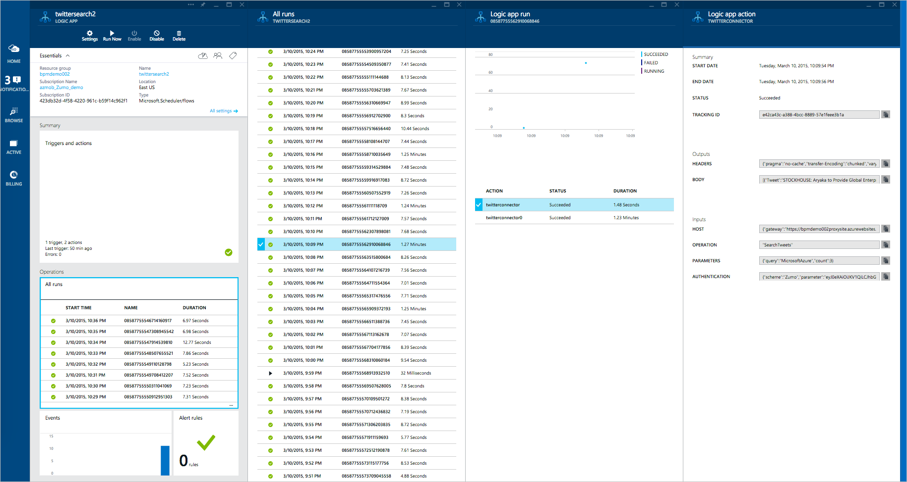
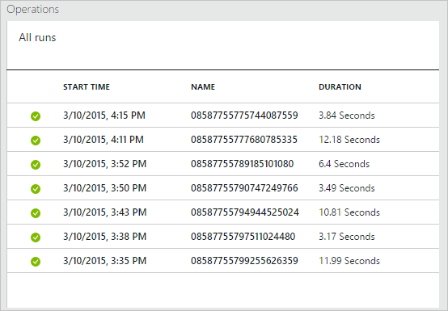
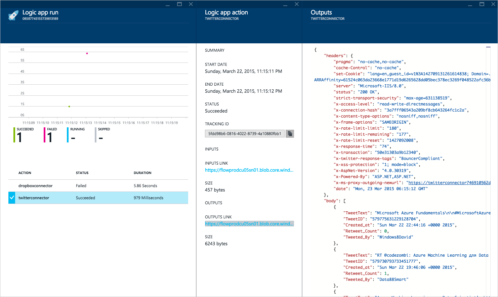
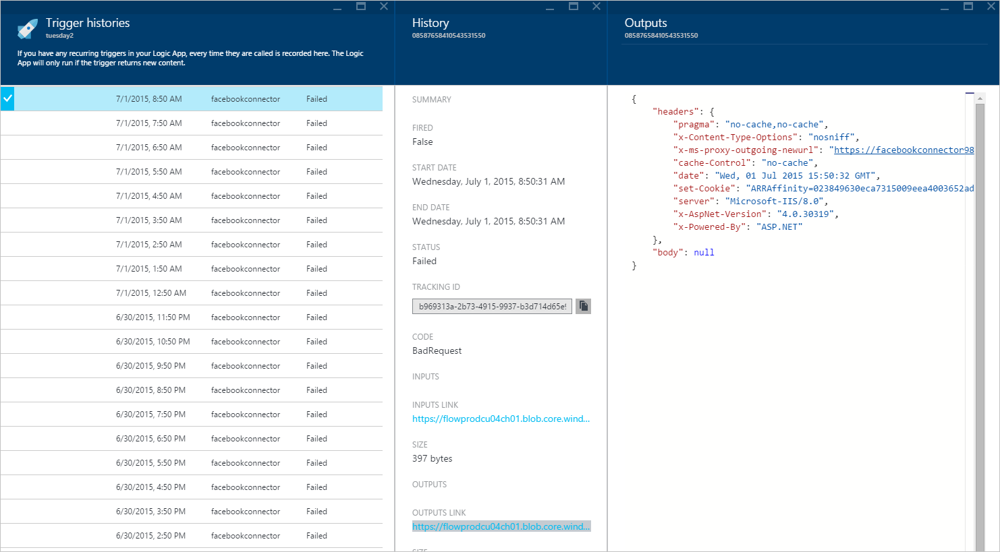

<properties 
	pageTitle="Monitor your Logic apps in Azure App Service | Microsoft Azure" 
	description="How to see what your Logic apps have done" 
	authors="stepsic-microsoft-com" 
	manager="erikre" 
	editor="" 
	services="app-service\logic" 
	documentationCenter=""/>

<tags
	ms.service="app-service-logic"
	ms.workload="integration"
	ms.tgt_pltfrm="na"
	ms.devlang="na"
	ms.topic="article"
	ms.date="05/31/2016"
	ms.author="stepsic"/>

# Monitor your Logic apps

After you [create a Logic app](app-service-logic-create-a-logic-app.md), you can see the full history of its execution in the Azure portal. To view the history, select **Browse**, and select **Logic apps**. A list of all Logic Apps in your subscription is displayed. You can select any Logic app, and can **Enable** or **Disable** it. **Enabled** Logic apps means that triggers run your Logic app in response to trigger events. **Disabled** Logic app do not run in response to events.

When the blade for your Logic app appears, there are 2 sections that are useful:

- **Summary** shows you the latest status and is an entry point to editing your Logic app.
- **All runs** shows you a list of the runs this Logic app has had.

## View the runs of your app

This list of runs shows the **Start time**, the **Run identifier** (you can use this when calling the REST API), and the **Duration** of the particular run. Select any row to see details on that run.

The details blade shows a graph with the execution time and sequence of all of the actions in the run. The following is the full list of all of the actions that were executed:  

Finally, on a particular action, you can get all of the data that was passed to the action, and that was received from the action in the **Inputs** and **Outputs** sections. Select the links to see the full content (you can also copy the links to download the content). 

Another important piece of information is the **Tracking ID**. This identifier is passed in the headers of all action calls. If you have logging inside of your own service, we recommend logging the Tracking ID, and then you can cross-reference your own logs with this identifier.

## View the Trigger history 

Polling triggers check an API on some interval but don't necessarily start a run, depending on the response (for example a `200` means to run and a `202` means to not run). The trigger history gives you a way to see all of the calls that happen but that don't run the Logic app (the `202` responses):  

For each trigger you can see if it **Fired**, if it didn't fire, or if it had some sort of error (it **Failed**). To inspect why your trigger failed, select the **Outputs** link. If it did fire, select the **Run** link to see what happened after it fired.

Note that for *Push* triggers, you do *not* see the times that the runs started here. Instead you see the *callback registration* calls; which are when the Logic app registers to get called back. If your push trigger is not working, it may be a problem with the registration (which you can see on the Outputs), but otherwise you many need to investigate that API specifically.

## Enabling Azure Diagnostics

You can enable Diagnostic information to retrieve and store runtime data for your workflows.  On the Logic App blade, scroll down to thee **Monitoring** charts and select **Click here to enable diagnostics**.  You can then configure against a storage account in the region of the Logic App and subscribe to **Logs** or **Metrics** from the Logic App.  **Logs** will send an event whenever a run, action, or event starts or completes.  **Metrics** give aggregated data around how many runs executed within a time window.   

## Enable versioning

There is an additional capability that is not currently possible in the UI (coming soon) but is available using the [REST API](https://msdn.microsoft.com/library/azure/mt643788.aspx). When you update the definition of a Logic App, the previous version of the definition is stored. This is because if you already have a run in progress, that run references the version of the Logic App that existed when the run started. Definitions of runs cannot change while they are in progress. The Version history REST API gives you access to this information.  

