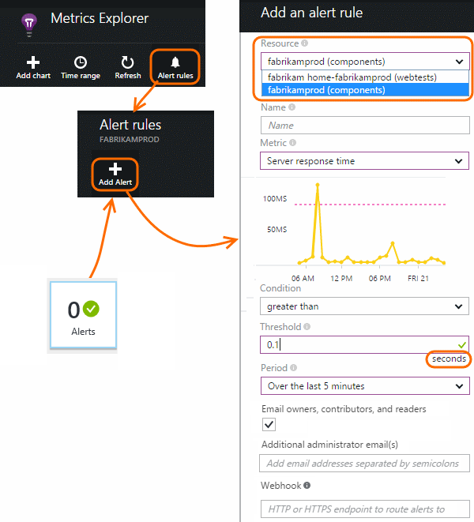
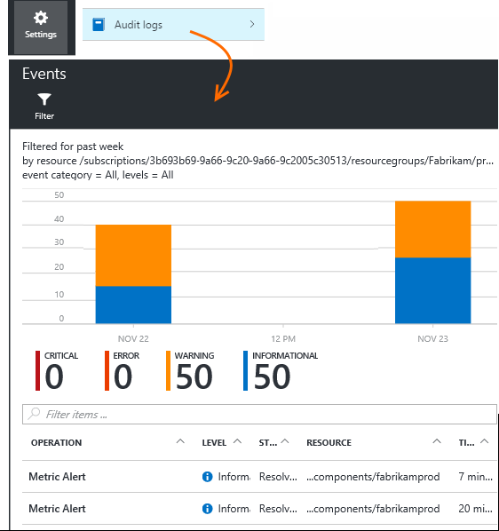

<properties 
	pageTitle="Set Alerts in Application Insights" 
	description="Get emails about crashes, exceptions, metric changes." 
	services="application-insights" 
    documentationCenter=""
	authors="alancameronwills" 
	manager="douge"/>

<tags 
	ms.service="application-insights" 
	ms.workload="tbd" 
	ms.tgt_pltfrm="ibiza" 
	ms.devlang="na" 
	ms.topic="article" 
	ms.date="06/20/2016" 
	ms.author="awills"/>
 
# Set Alerts in Application Insights

[Visual Studio Application Insights][start] can alert you to changes in performance or usage metrics in your app. 

Application Insights monitors your live app on a [wide variety of platforms][platforms] to help you diagnose performance issues and understand usage patterns.

There are two kinds of alerts:
 
* **Web tests** tell you when your site is unavailable on the internet, or responding slowly. [Learn more][availability].
* **Metric alerts** tell you when any metric crosses a threshold value for some period - such as failure counts, memory, or page views. 

There's a [separate page about web tests][availability], so we'll focus on metric alerts here.

> [AZURE.NOTE] In addition, you might get emails from [Proactive detection](app-insights-proactive-detection.md), warning you of unusual patterns in your app's performance. Unlike alerts, these notifications run without you having to set them up. They are aimed at tuning your app's performance, rather than raising the alarm about immediate problems.

## Metric alerts

If you haven't set up Application Insights for your app, [do that first][start].

To get an email when a metric crosses a threshold, start either from Metrics Explorer, or from the Alert rules tile on the overview blade.

* Set the resource before the other properties. **Choose the "(components)" resource** if you want to set alerts on performance or usage metrics.
* Be careful to note the units in which you're asked to enter the threshold value.
* The name that you give to the alert must be unique within the resource group (not just your application).
* If you check the box "Email owners...", alerts will be sent by email to everyone who has access to this resource group. To expand this set of people, add them to the [resource group or subscription](app-insights-resources-roles-access-control.md) (not the resource).
* If you specify "Additional emails", alerts will be sent to those individuals or groups (whether or not you checked the "email owners..." box). 
* Set a [webhook address](../azure-portal/insights-webhooks-alerts.md) if you have set up a web app that will respond to alerts. It will be called both when the alert is Activated (that is, triggered) and when it is Resolved. (But note that at present, query parameters are not passed through as webhook properties.)
* You can Disable or Enable the alert: see the buttons at the top of the blade.

*I don't see the Add Alert button.* - Are you using an organizational account? You can set alerts if you have owner or contributor access to this application resource. Take a look at Settings -> Users. [Learn about access control][roles].

> [AZURE.NOTE] In the alerts blade, you'll see that there's already an alert set up: [NRT Proactive Diagnosis](app-insights-nrt-proactive-diagnostics.md). This is an automatic alert that monitors one particular metric, request failure rate. So unless you decide to disable this, you don't need to set your own alert on request failure rate. 

## See your alerts

You get an email when an alert changes state between inactive and active. 

The current state of each alert is shown in the Alert rules blade.

There's a summary of recent activity in the alerts drop-down:

The history of state changes is in the Audit Log:

## How alerts work

* An alert has three states: "Never activated", "Activated", and "Resolved". Activated means the condition you specified was true, when it was last evaluated.

* A notification is generated when an alert changes state. (If the alert condition was already true when you created the alert, you might not get a notification until the condition goes false.)

* Each notification generates an email if you checked the emails box, or provided email addresses. You can also look at the Notifications drop-down list.

* An alert is evaluated each time a metric arrives, but not otherwise.

* The evaluation aggregates the metric over the preceding period, and then compares it to the threshold to determine the new state.

* The period that you choose specifies the interval over which metrics are aggregated. It doesn't affect how often the alert is evaluated: that depends on the frequency of arrival of metrics.

* If no data arrives for a particular metric for some time, the gap has different effects on alert evaluation and on the charts in metric explorer. In metric explorer, if no data is seen for longer than the chart's sampling interval, the chart will show a value of 0. But an alert based on the same metric will not be re-evaluated, and the alert's state will remain unchanged. 

    When data eventually arrives, the chart will jump back to a non-zero value. The alert will evaluate based on the data available for the period you specified. If the new data point is the only one available in the period, the aggregate will be based just on that.

* An alert can flicker frequently between alert and healthy states, even if you set a long period. This can happen if the metric value hovers around the threshold. There is no hysteresis in the threshold: the transition to alert happens at the same value as the transition to healthy.

## Availability alerts

You can set up web tests that test any web site from points around the world. [Learn more][availability].

## What are good alerts to set?

It depends on your application. To start with, it's best not to set too many metrics. Spend some time looking at your metric charts while your app is running, to get a feel for how it behaves normally. This will help you find ways to improve its performance. Then set up alerts to tell you when the metrics go outside the normal zone. 

Popular alerts include:

* [Web tests][availability] are important if your application is a website or web service that is visible on the public internet. They tell you if your site goes down or responds slowly - even if it's the carrier's problem rather than your app. But they're synthetic tests, so they don't measure your users' actual experience.
* [Browser metrics][client], especially Browser **page load times**, are good for web applications. If your page has a lot of scripts, you'll want to look out for **browser exceptions**. In order to get these metrics and alerts, you have to set up [web page monitoring][client].
* **Server response time** and **Failed requests** for the server side of web applications. As well as setting up alerts, keep an eye on these metrics to see if they vary disproportionately with high request rates: that might indicate that your app is running out of resources.
* **Server exceptions** - to see them, you have to do some [additional setup](app-insights-asp-net-exceptions.md).

## Automation

* [Use PowerShell to automate setting up alerts](app-insights-powershell-alerts.md)
* [Use webhooks to automate responding to alerts](../azure-portal/insights-webhooks-alerts.md)

## See also

* [Availability web tests](app-insights-monitor-web-app-availability.md)
* [Automate setting up alerts](app-insights-powershell-alerts.md)
* [Proactive detection](app-insights-proactive-detection.md) 

<!--Link references-->

[availability]: app-insights-monitor-web-app-availability.md
[client]: app-insights-javascript.md
[platforms]: app-insights-platforms.md
[roles]: app-insights-resources-roles-access-control.md
[start]: app-insights-overview.md

 