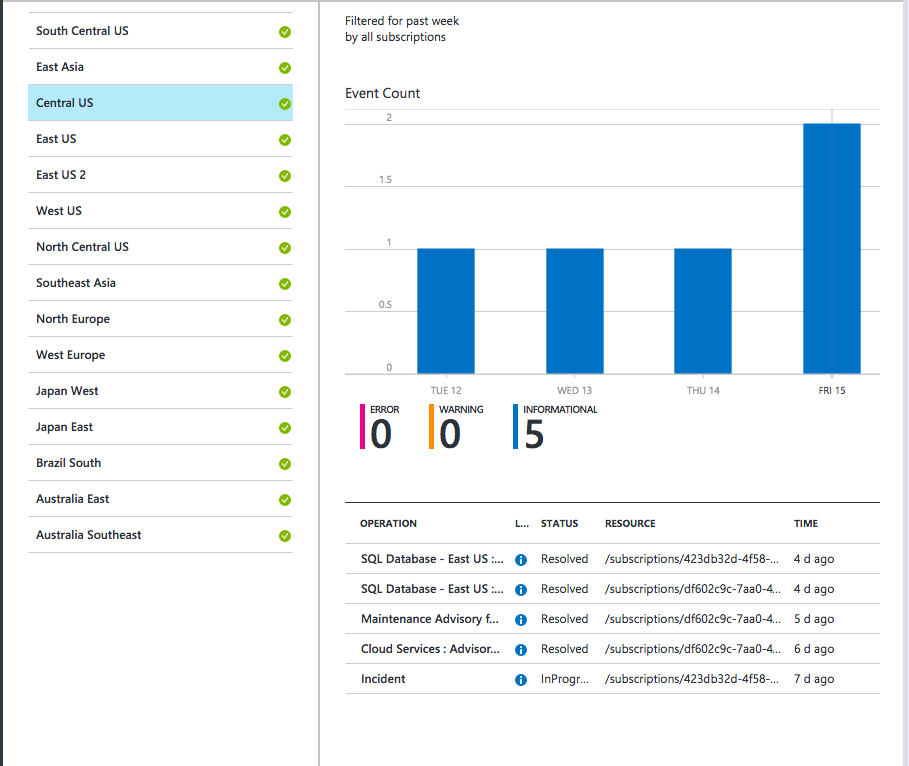
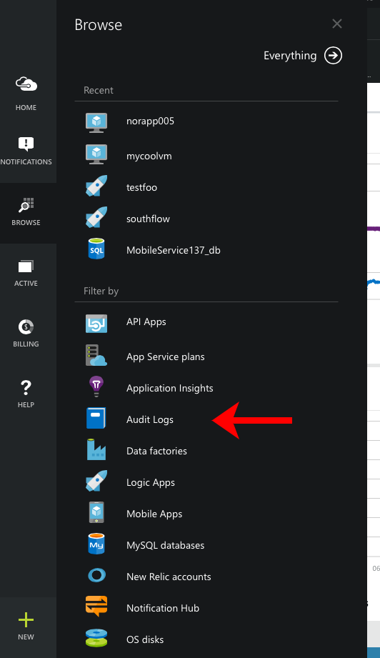
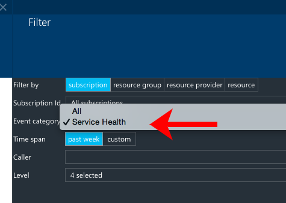
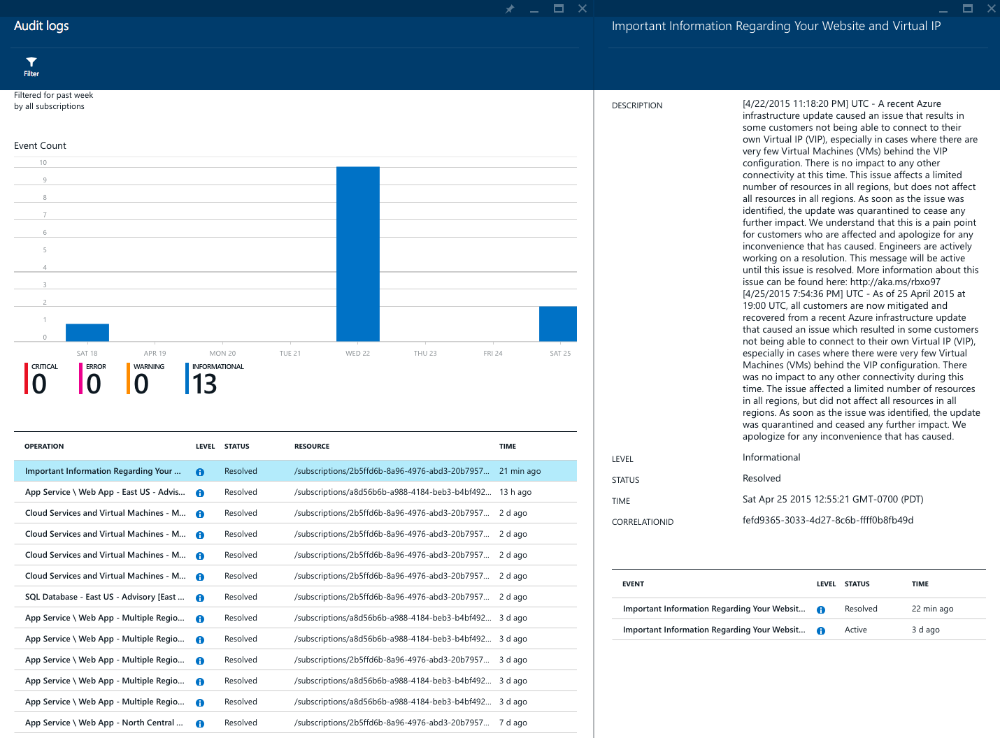

<properties
	pageTitle="Track service health"
	description="Find out when Azure has experienced performance degradation or service interruptions. "
	authors="stepsic-microsoft-com"
	manager="kamrani"
	editor=""
	services="azure-portal"
	documentationCenter="na"/>

<tags
	ms.service="azure-portal"
	ms.workload="na"
	ms.tgt_pltfrm="na"
	ms.devlang="na"
	ms.topic="article"
	ms.date="09/08/2015"
	ms.author="stepsic"/>

# Track service health

Azure publicizes each time there is a service interruption or performance degradation. You can browse these events in the Azure portal, and you can also use the [REST API](https://msdn.microsoft.com/library/azure/dn931927.aspx) or [.NET SDK](https://www.nuget.org/packages/Microsoft.Azure.Insights/) to access the full set of events programmatically.

## See the service health by region

1. Sign in to the [Azure Portal](https://portal.azure.com/).

2. On **Home** you should see a tile called **Service health**
    

3. Clicking that tile will give you a list of all the regions in Azure. You can click any region to see the service health history for that region.
    

4. You can also see the details of an individual incident by clicking that in the table.

## Browse the full service health logs

2. Click on the **Browse** and select **Audit logs**.  
    

3. This will open up a blade showing all of the events that have impacted any of your subscriptions for the past 7 days. Service health entries will show up in this list, but it may be difficult to find them as the list can be large.

4. Click the **Filter** command.

5. Select **Event category** and choose **Service health**:
    

6. Click **Updated**.

7. You will now see all of the service health events that have impacted your subscription:
    

8. From there you can go to the details blade to see the specifics of the event.

## Next steps

* [Receive alert notifications](insights-receive-alert-notifications.md) whenever an event happens.
* [Monitor service metrics](insights-how-to-customize-monitoring.md) to make sure your service is available and responsive.
* [Monitor availability and responsiveness of any web page](../application-insights/app-insights-monitor-web-app-availability.md) with Application Insights so you can find out if your page is down.
