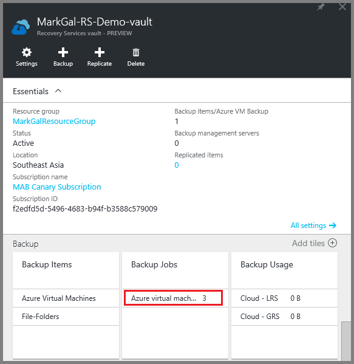

<properties
	pageTitle="Back up Azure Resource Manager virtual machines | Microsoft Azure"
	description="Discover, register, and back up your ARM virtual machines to a recovery services vault with these procedures for Azure virtual machine backup."
	services="backup"
	documentationCenter=""
	authors="markgalioto"
	manager="jwhit"
	editor=""
	keywords="virtual machine backup; back up virtual machine; backup and disaster recovery; arm vm backup"/>

<tags
	ms.service="backup"
	ms.workload="storage-backup-recovery"
	ms.tgt_pltfrm="na"
	ms.devlang="na"
	ms.topic="article"
	ms.date="05/04/2016"
	ms.author="trinadhk; jimpark; markgal;"/>

# Back up Azure Resource Manager (ARM) virtual machines

> [AZURE.SELECTOR]
- [Back up ARM VMs to Azure](backup-azure-arm-vms.md)
- [Back up Azure virtual machines](backup-azure-vms.md)

This article provides the procedure for backing up Azure Resource Manager (ARM) virtual machines (VMs) to a Recovery Services vault. The majority of work for backing up an ARM VM goes into the preparation. Before you can back up or protect an Azure virtual machine, you must complete the [prerequisites](backup-azure-arm-vms-prepare.md) to prepare your environment for protecting your VMs. Once you have completed the prerequisites, then you can initiate the back up operation to take snapshots of your VM.

>[AZURE.NOTE] Azure has two deployment models for creating and working with resources: [Resource Manager and Classic](../resource-manager-deployment-model.md). This article is for use with Resource Manager and ARM-based VMs. See [Back up Azure virtual machines](backup-azure-vms.md) for details on working with Classic deployment model VMs.

For additional information, see the articles on [planning your VM backup infrastructure in Azure](backup-azure-vms-introduction.md) and [Azure virtual machines](https://azure.microsoft.com/documentation/services/virtual-machines/).

## Triggering the back up job

The back up policy associated with the Recovery Services vault, defines how often and when the backup operation runs. By default, the first scheduled backup is the initial backup. Until the initial backup occurs, the Last Backup Status on the **Backup Jobs** blade shows as **Warning(initial backup pending)**.

Unless your initial backup is due to begin very soon, it is recommended that you run **Back up Now**. The following procedure starts from the vault dashboard. This procedure serves for running the initial backup job after you have completed all prerequisites. If the initial backup job has already been run, this procedure is not available. The associated backup policy determines the next backup job.  

To run the initial backup job:

1. On the vault dashboard, on the **Backup** tile, click **Azure Virtual Machines**.  
    

    The **Backup Items** blade opens.

2. On the **Backup Items** blade, right-click the vault you want to back up, and click **Backup now**.

    

    The Backup job is triggered.  

    

3. To view that your initial backup has completed, on the vault dashboard, on the **Backup Jobs** tile, click **Azure virtual machines**.

    

    The Backup Jobs blade opens.

4. In the **Backup jobs** blade, you can see the status of all jobs.

    

    >[AZURE.NOTE] As a part of the backup operation, the Azure Backup service issues a command to the backup extension in each virtual machine to flush all writes and take a consistent snapshot.

    When the backup job is finished, the status is *Completed*.

## Troubleshooting errors
If you run into issues while backing up your virtual machine, please see the [VM troubleshooting article](backup-azure-vms-troubleshoot.md) for help.

## Next steps

Now that you have protected your VM, check out the following articles for additional management tasks  you can do with your VMs, and how to restore VMs.

- [Manage and monitor your virtual machines](backup-azure-manage-vms.md)
- [Restore virtual machines](backup-azure-arm-restore-vms.md)
