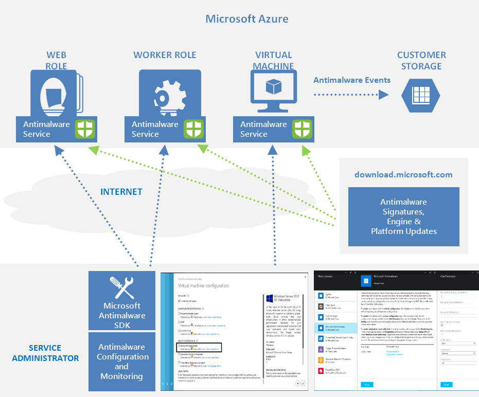
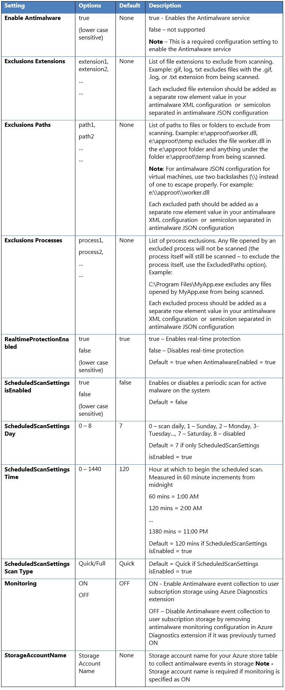
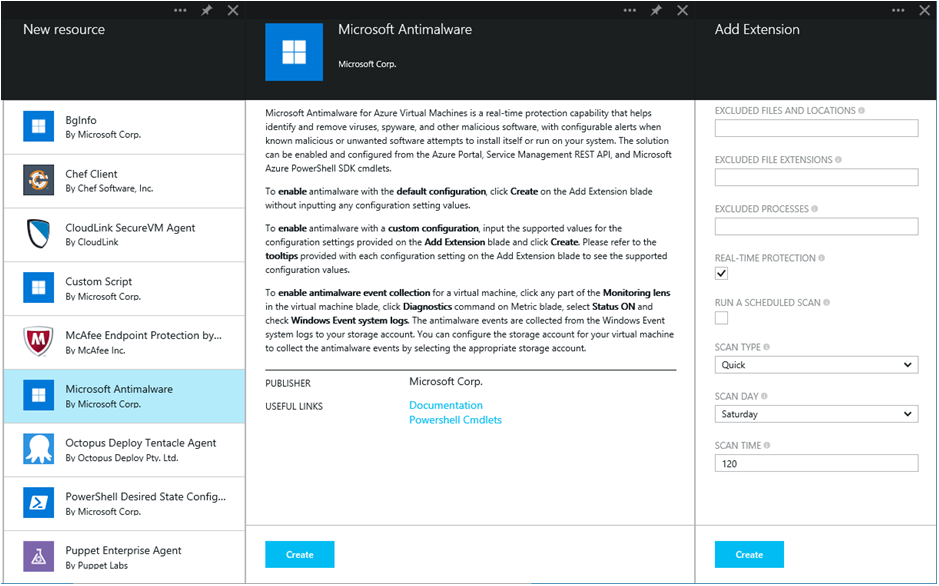
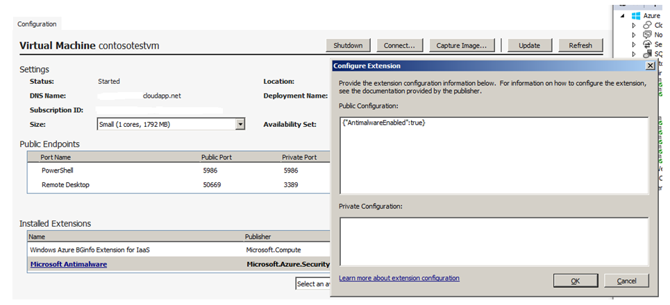

<properties
   pageTitle="Microsoft Antimalware for Azure Cloud Services and Virtual Machines | Microsoft Azure"
   description="This article provides an architectural overview of Microsoft Antimalware for Azure, including supported scenarios and configurations for enabling, configuring, and deploying protection for Azure Cloud Services and Virtual Machines. We will cover basic configuration, management, and monitoring functionality accessible through Microsoft Azure service management API’s, PowerShell scripts, the Azure Management Portal and Visual Studio."
   services="security"
   documentationCenter="na"
   authors="YuriDio"
   manager="swadhwa"
   editor=""/>

<tags
   ms.service="security"
   ms.devlang="na"
   ms.topic="article"
   ms.tgt_pltfrm="na"
   ms.workload="na"
   ms.date="06/14/2016"
   ms.author="yurid"/>

#Microsoft Antimalware for Azure Cloud Services and Virtual Machines

The modern threat landscape for cloud environments is extremely dynamic, increasing the pressure on business IT cloud subscribers to maintain effective protection in order to meet compliance and security requirements. Microsoft Antimalware for Azure Cloud Services and Virtual Machines is a real-time protection capability that helps identify and remove viruses, spyware, and other malicious software, with configurable alerts when known malicious or unwanted software attempts to install itself or run on your Azure systems.

The solution is built on the same antimalware platform as Microsoft Security Essentials \[MSE\], Microsoft Forefront Endpoint Protection, Microsoft System Center Endpoint Protection, Windows Intune, and Windows Defender for Windows 8.0 and higher. Microsoft Antimalware for Azure is a single-agent solution for applications and tenant environments, designed to run in the background without human intervention. You can deploy protection based on the needs of your application workloads, with either basic secure-by-default or advanced custom configuration, including antimalware monitoring.

When you deploy and enable Microsoft Antimalware for Azure for your applications, the following core features are available:

**Real-time protection** - monitors activity in Cloud Services and on Virtual Machines to detect and block malware execution.

**Scheduled scanning** - periodically performs targeted scanning to detect malware, including actively running programs.

**Malware remediation** - automatically takes action on detected malware, such as deleting or quarantining malicious files and cleaning up malicious registry entries.

**Signature updates** - automatically installs the latest protection signatures (virus definitions) to ensure protection is up-to-date on a pre-determined frequency.

**Antimalware Engine updates** – automatically updates the Microsoft Antimalware engine.

**Antimalware Platform updates** – automatically updates the Microsoft Antimalware platform.

**Active protection** - reports telemetry metadata about detected threats and suspicious resources to Microsoft Azure to ensure rapid response to the evolving threat landscape, as well as enabling real-time synchronous signature delivery through the Microsoft Active Protection System (MAPS).

**Samples reporting** - provides and reports samples to the Microsoft Antimalware service to help refine the service and enable troubleshooting.

**Exclusions** – allows application and service administrators to configure certain files, processes, and drives to exclude them from protection and scanning for performance and/or other reasons.

**Antimalware event collection** - records the antimalware service health, suspicious activities, and remediation actions taken in the operating system event log and collects them into the customer’s Azure Storage account.

##Architecture

The Microsoft Antimalware for Azure Cloud Services and Virtual Machines solution includes the Microsoft Antimalware Client and Service, Antimalware Service Management Extension, Antimalware PowerShell cmdlets and Azure Diagnostics Extension. The Microsoft Antimalware solution is supported on Windows Server 2008 R2, Windows Server 2012, and Windows Server 2012 R2 operating system families. It is not supported on the Windows Server 2008 operating system. At this time, Windows Server Technical Preview is not supported and we intend to support it in the future.

The Microsoft Antimalware Client and Service is installed by default in a disabled state in all supported Azure guest operating system families in the Cloud Services platform.

The Microsoft Antimalware Client and Service is not installed by default in the Virtual Machines platform and is available as an optional feature through the Azure Management Portal and Visual Studio Virtual Machine configuration under Security Extensions.

If using Azure Websites, the underlying server that hosts the web app has Microsoft Antimalware enabled on it. If a web app includes a file that is detected as malware by Microsoft Antimalware engine running on the hosting server, it may get deleted as part of the real time detection and remediation. This protects Microsoft from someone who has set up an account fraudulently and attempts to host a piece of malware.  It protects Microsoft from someone who was compromised without knowing it and their site is used to host a piece of malware.  It also protects other users on the Internet who might be directed to download that piece of malware.  Last but not least, it also protects the reputation of Microsoft's pool of shared Azure IP addresses from getting blacklisted by third party blacklists who also scan web sites looking for a piece of malware.  Older versions of node.js and similar libraries may have known security vulnerabilities.  One advice to customers might be to make sure they have moved to the latest fully patched version of node.js if they are experiencing this issue.  There is a risk of false positive from time to time, these are investigated and reported to the Protection team and the engine is generally updated quickly to prevent that from becoming more of a problem in the future. 

###Microsoft Antimalware Workflow

The Azure service administrator can enable Antimalware for Azure with a default or custom configuration for your Virtual Machines and Cloud Services using the following options:

-   Virtual Machines – In the Azure Management Portal, under Security Extensions

-   Virtual Machines – Using the Visual Studio virtual machines configuration in Server Explorer

-   Virtual Machines and Cloud Services – Using the Antimalware service management APIs (SMAPI)

-   Virtual Machines and Cloud Services – Using Antimalware PowerShell cmdlets

The Azure Management Portal or PowerShell cmdlets push the Antimalware extension package file to the Azure system at a pre-determined fixed location. The Azure Guest Agent (or the Fabric Agent) launches the Antimalware Extension, applying the Antimalware configuration settings supplied as input. This step enables the Antimalware service with either default or custom configuration settings. If no custom configuration is provided, then the antimalware service is enabled with the default configuration settings. Refer to the *Antimalware configuration* section in the [Microsoft Antimalware for Azure Cloud Services and Virtual Machines – Code Samples](http://aka.ms/amazsamples "Microsoft Antimalware For Azure Cloud Services and VMs Code Samples") for more details.

Once running, the Microsoft Antimalware client downloads the latest protection engine and signature definitions from the Internet and loads them on the Azure system. The Microsoft Antimalware service writes service-related events to the system OS events log under the “Microsoft Antimalware” event source. Events include the Antimalware client health state, protection and remediation status, new and old configuration settings, engine updates and signature definitions, and others.

You can enable Antimalware monitoring for your Cloud Service or Virtual Machine to have the Antimalware event log events written as they are produced to your Azure storage account. The Antimalware Service uses the Azure Diagnostics extension to collect Antimalware events from the Azure system into tables in the customer’s Azure Storage account.

The deployment workflow including configuration steps and options supported for the above scenarios are documented in [Antimalware deployment scenarios](#_Antimalware_Deployment_Scenarios) section of this document.

###Default and Custom Antimalware Configuration

The default configuration settings are applied to enable Antimalware for Azure Cloud Services or Virtual Machines when you do not provide custom configuration settings. The default configuration settings have been pre-optimized for running in the Azure environment. Optionally, you can customize these default configuration settings as required for your Azure application or service deployment and apply them for other deployment scenarios.

The following table summarizes the configuration settings available for the Antimalware service. The default configuration settings are marked under the column labelled “Default” below.

##Antimalware Deployment Scenarios

The scenarios to enable and configure antimalware, including monitoring for Azure Cloud Services and Virtual Machines, are discussed in this section.

###Virtual Machines - Enable and Configure Antimalware

**Deployment using Azure Preview Portal**

To enable the Antimalware service, click **Add** on the Extensions blade, select **Microsoft Antimalware** on the New resource blade, click **Create** on the Microsoft Antimalware blade. Click **Create** without inputting any configuration values to enable Antimalware with the default settings, or enter the Antimalware configuration settings for the Virtual Machine configured as shown in Figure 2 below. Please refer to the **tooltips** provided with each configuration setting on the Add Extension blade to see the supported configuration values.

**Deployment Using the Azure Management Portal**

To enable and configure Microsoft Antimalware for Azure Virtual Machines using the Azure Management Portal while provisioning a Virtual Machine, follow the steps below:

1.Log onto the Azure Management Portal at <https://manage.windowsazure.com>

2.To create a new virtual machine, click **New**, **Compute**, **Virtual** **Machine**, **From Gallery** (do not use Quick Create) as shown below:

3.Select the **Microsoft Windows Server** image on the **Choose an Image** page.

4.Click the right arrow and input the Virtual Machine configuration.

5.Check the **Microsoft Antimalware** checkbox under **Security Extensions** on the Virtual Machine configuration page.

6.Click the Submit button to enable and configure Microsoft Antimalware for Azure Virtual Machines with the default configuration settings.

**Deployment Using the Visual Studio Virtual Machine Configuration**

To enable and configure the Microsoft Antimalware service using Visual Studio:

1.Connect to Microsoft Azure in Visual Studio.

2.Choose your Virtual Machine in the **Virtual Machines** node in **Server Explorer**

3.Right click **configure** to view the Virtual Machine configuration page

4.Select **Microsoft Antimalware** extension from the dropdown list under **Installed Extensions** and click **Add** to configure with default antimalware configuration.

5.To customize the default Antimalware configuration, select (highlight) the Antimalware extension in the installed extensions list and click **Configure**.

6.Replace the default Antimalware configuration with your custom configuration in supported JSON format in the **public configuration** textbox and click OK.

7.Click the **Update** button to push the configuration updates to your Virtual Machine.

**Note:** The Visual Studio Virtual Machines configuration for Antimalware supports only JSON format configuration. The Antimalware JSON configuration settings template is included in the [Microsoft Antimalware For Azure Cloud Services and Virtual Machine - Code Samples](http://aka.ms/amazsamples "Microsoft Antimalware For Azure Cloud Services and Virtual Machine - Code Samples"), showing the supported Antimalware configuration settings.

**Deployment Using PowerShell cmdlets**

An Azure application or service can enable and configure Microsoft Antimalware for Azure Virtual Machines using PowerShell cmdlets.

To enable and configure Microsoft antimalware using antimalware PowerShell cmdlets:

1. Set up your PowerShell environment - Refer to the documentation at <https://github.com/Azure/azure-powershell>

2. Use the Set-AzureVMMicrosoftAntimalwareExtension Antimalware cmdlet to enable and configure Microsoft Antimalware for your Virtual Machine as documented at <http://msdn.microsoft.com/library/azure/dn771718.aspx>

**Note:** The Azure Virtual Machines configuration for Antimalware supports only JSON format configuration. The Antimalware JSON configuration settings template is included in the [Microsoft Antimalware For Azure Cloud Services and Virtual Machine - Code Samples](http://aka.ms/amazsamples "Microsoft Antimalware For Azure Cloud Services and Virtual Machine - Code Samples"), showing the supported Antimalware configuration settings.

###Enable and Configure Antimalware Using PowerShell cmdlets

An Azure application or service can enable and configure Microsoft Antimalware for Azure Cloud Services using PowerShell cmdlets. Note that Microsoft Antimalware is installed in a disabled state in the Cloud Services platform and requires an action by an Azure application to enable it.

To enable and configure Microsoft Antimalware using PowerShell cmdlets:

1.  Set up your PowerShell environment - Refer to the documentation at <https://github.com/Azure/azure-sdk-tools#get-started>

2.  Use the Set-AzureServiceAntimalwareExtension Antimalware cmdlet to enable and configure Microsoft Antimalware for your Cloud Service as documented at <http://msdn.microsoft.com/library/azure/dn771718.aspx>

The Antimalware XML configuration settings template is included in the [Microsoft Antimalware For Azure Cloud Services and Virtual Machine - Code Samples](http://aka.ms/amazsamples "Microsoft Antimalware For Azure Cloud Services and Virtual Machine - Code Samples"), showing the supported Antimalware configuration settings.

###Cloud Services and Virtual Machines - Configuration Using PowerShell cmdlets

An Azure application or service can retrieve the Microsoft Antimalware configuration for Cloud Services and Virtual Machines using PowerShell cmdlets.

To retrieve the Microsoft Antimalware configuration using PowerShell cmdlets:

1.  Set up your PowerShell environment - Refer to the documentation at <https://github.com/Azure/azure-sdk-tools#get-started>

2.  **For Virtual Machines**: Use the Get-AzureVMMicrosoftAntimalwareExtension Antimalware cmdlet to get the antimalware configuration as documented at <http://msdn.microsoft.com/library/azure/dn771719.aspx>

3.  **For Cloud Services**: Use the Get-AzureServiceAntimalwareConfig Antimalware cmdlet to get the Antimalware configuration as documented at <http://msdn.microsoft.com/library/azure/dn771722.aspx>

###Remove Antimalware Configuration Using PowerShell cmdlets

An Azure application or service can remove the Antimalware configuration and any associated Antimalware monitoring configuration from the relevant Azure Antimalware and diagnostics service extensions associated with the Cloud Service or Virtual Mmachine.

To remove Microsoft Antimalware using PowerShell cmdlets:

1.  Set up your PowerShell environment - Refer to the documentation at <https://github.com/Azure/azure-sdk-tools#get-started>

2.  **For Virtual Machines**: Use the Remove-AzureVMMicrosoftAntimalwareExtension Antimalware cmdlet as documented at <http://msdn.microsoft.com/library/azure/dn771720.aspx>

3.  **For Cloud Services:** Use the Remove-AzureServiceAntimalwareExtension Antimalware cmdlet as documented at <http://msdn.microsoft.com/library/azure/dn771717.aspx>

To **enable** antimalware event collection for a virtual machine using the Azure Preview Portal:

1.  Click any part of the Monitoring lens in the Virtual Machine blade

2.  Click the Diagnostics command on Metric blade

3.  Select **Status** ON and check the option for Windows event system logs. You can choose to uncheck all other options in the list, or leave them enabled per your application service needs.

4.  The Antimalware event categories “Error”, “Warning”, “Informational”, etc., are captured in your Azure Storage account.

Antimalware events are collected from the Windows event system logs to your Azure Storage account. You can configure the Storage Account for your Virtual Machine to collect Antimalware events by selecting the appropriate storage account.

###Enable and Configure Antimalware Monitoring Using PowerShell cmdlets

You can enable collection of Microsoft Antimalware events for your Cloud Service or Virtual Machine using Azure Diagnostics through Antimalware PowerShell cmdlets. The Azure Diagnostics extension can be configured to capture events from the System event log source “Microsoft Antimalware” to your Azure Storage account. The Antimalware event categories “Error”, “Warning”, “Informational”, etc., are captured in your Azure Storage account.

To enable Antimalware event collection to your Azure Storage account using PowerShell cmdlets:

1.  Set up your PowerShell environment - Refer to <https://github.com/Azure/azure-sdk-tools#get-started>

2.  **For Virtual Machines** - Use the Set-AzureVMMicrosoftAntimalwareExtension Antimalware cmdlet with Monitoring ON option as documented at <http://msdn.microsoft.com/library/azure/dn771716.aspx>

3.  **For Cloud Services** - Use the Set-AzureServiceAntimalwareExtension Antimalware cmdlet with Monitoring ON option as documented at <http://msdn.microsoft.com/library/azure/dn771718.aspx>

You can view the Antimalware raw events by looking at the WADWindowsEventLogsTable table in your Azure Storage account that you configured to enable Antimalware monitoring. This can be useful to validate that Antimalware event collection is working, including getting insight into the Antimalware service’s health. For more details, including sample code on how to extract Antimalware events from your storage account, refer to [Microsoft Antimalware For Azure Cloud Services and Virtual Machine - Code Samples](http://aka.ms/amazsamples "Microsoft Antimalware For Azure Cloud Services and Virtual Machine - Code Samples").
