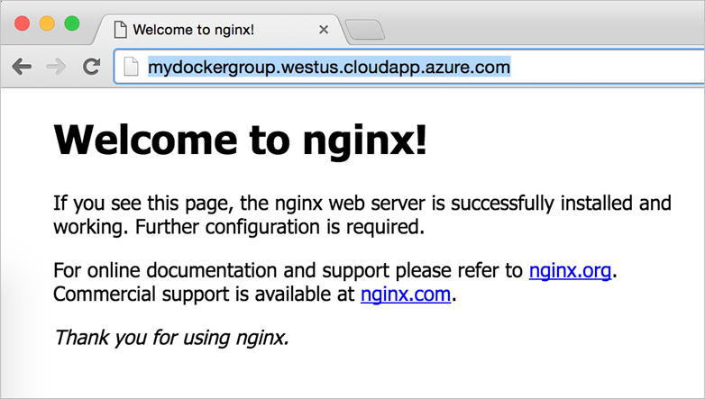

<properties
   pageTitle="Learn about the Docker VM Extenstion on Azure | Microsoft Azure"
   description="Learn how to use the Docker VM Extension to quickly and securely deploy a Docker environment in Azure"
   services="virtual-machines-linux"
   documentationCenter=""
   authors="iainfoulds"
   manager="timlt"
   editor=""/>

<tags
   ms.service="virtual-machines-linux"
   ms.devlang="na"
   ms.topic="article"
   ms.tgt_pltfrm="vm-linux"
   ms.workload="infrastructure"
   ms.date="05/04/2016"
   ms.author="iainfou"/>

# Using the Docker VM Extension to deploy your environment

Docker is a popular container management and imaging platform that allows you to quickly work with containers on Linux (and Windows as well). With Azure, you have the flexibility to deploy Docker in a few different manners depending on your needs:

- To quickly prototype an app, or if you already know and use Docker Machine, you can [use the Docker Machine Azure driver](./virtual-machines-linux-docker-machine.md) to deploy Docker hosts within Azure.
- For a template based deployment, the Docker VM extension for Azure virtual machines can be used. This approach can integrate with Azure Resource Manager template deployments and includes all of the related benefits such as role base access, diagnostics, and post deployment configuration.
- The Docker VM extension also supports Docker Compose, which uses a declarative YAML file to take a developer-modeled application across any environment and generate a consistent deployment.  
- You can also [deploy a full Docker Swarm cluster on Azure Container Services](../container-service/container-service-deployment.md) for production-ready, scalable deployments that leverage the additional scheduling and management tools provided by Swarm.

This article focuses on using resource manager templates to deploy the Docker VM Extension in a custom, production-ready environment that you define.

## Azure Docker VM Extension for template deployments

The Azure Docker VM Extension installs and configures the Docker daemon, Docker client, and Docker Compose in your Linux virtual machine. The extension can also be used to define and deploy container applications using Docker compose. By using resource manager templates, the environment can then be re-deployed in a consistent fashion. Using the Azure Docker VM Extension is well suited for a more robust developer or production environments as you have some additional controls over simply using Docker Machine or creating the Docker host yourself.

Using Azure Resource Manager, you can create and deploy templates that define the entire structure of your environment, such as the Docker hosts, storage, Role Based Access Controls (RBAC), diagnostics, etc. You can [read more about Resource Manager](../resource-group-overview.md) and templates to better understand some of the benefits. The advantage of using Resource Manager templates over simply using Docker Machine is that you can define additional Docker hosts, storage, access controls, etc. and be able to reproduce the deployments as needed in the future. 

## Deploy a template with the Docker VM Extension:

Let's use an existing quick-start template to show how to deploy an Ubuntu VM which has the Docker VM Extension installed. You can view the template here: [Simple deployment of an Ubuntu VM with Docker](https://github.com/Azure/azure-quickstart-templates/tree/master/docker-simple-on-ubuntu)

Deploy the template using the Azure CLI, specifying a name for our new resource group (here `myDockerResourceGroup`) along with the template URI:

```
azure group create --name myDockerResourceGroup --location "West US" \
  --template-uri https://raw.githubusercontent.com/Azure/azure-quickstart-templates/master/docker-simple-on-ubuntu/azuredeploy.json
```

Answer the prompts for naming your storage account, DNS name, username, etc. and then give it a few minutes to finish the deployment. You should see output similar to the following:

```
info:    Executing command group create
+ Getting resource group myDockerResourceGroup
+ Updating resource group myDockerResourceGroup
info:    Updated resource group myDockerResourceGroup
info:    Supply values for the following parameters
newStorageAccountName: mydockerstorage
adminUsername: ops
adminPassword: P@ssword!
dnsNameForPublicIP: mydockergroup
+ Initializing template configurations and parameters
+ Creating a deployment
info:    Created template deployment "azuredeploy"
data:    Id:                  /subscriptions/guid/resourceGroups/myDockerResourceGroup
data:    Name:                myDockerResourceGroup
data:    Location:            westus
data:    Provisioning State:  Succeeded
data:    Tags: null
data:
info:    group create command OK

```

## Deploy your first nginx container

Once the deployment has finished, SSH to your new Docker host using the DNS name you provided during deployment. The Docker tools will already be installed, so let's try to run an nginx container:

```
docker run -d -p 80:80 nginx
```

You should see output similar to the following:

```
Unable to find image 'nginx:latest' locally
latest: Pulling from library/nginx
efd26ecc9548: Pull complete
a3ed95caeb02: Pull complete
a48df1751a97: Pull complete
8ddc2d7beb91: Pull complete
Digest: sha256:2ca2638e55319b7bc0c7d028209ea69b1368e95b01383e66dfe7e4f43780926d
Status: Downloaded newer image for nginx:latest
b6ed109fb743a762ff21a4606dd38d3e5d35aff43fa7f12e8d4ed1d920b0cd74
```

Examine the container running on your host using `docker ps`:

```
CONTAINER ID        IMAGE               COMMAND                  CREATED              STATUS              PORTS                         NAMES
b6ed109fb743        nginx               "nginx -g 'daemon off"   About a minute ago   Up About a minute   0.0.0.0:80->80/tcp, 443/tcp   nostalgic_murdock
```

Open up a web browser and enter the DNS name you specified during deployment to see your container in action:



For additional information on the Docker VM extension such as configuring the Docker daemon TCP port, configuring security, and deploying containers using Docker Compose, see the  [Azure Virtual Machine Extension for Docker GitHub project]( https://github.com/Azure/azure-docker-extension/).

## Docker VM Extension JSON template reference

This example used a quick-start template. You can use your own existing Resource Manager templates to install the Docker VM Extension to VMs defined in your template by adding the following to your JSON definition file:

```
{
  "type": "Microsoft.Compute/virtualMachines/extensions",
  "name": "[concat(variables('vmName'), '/DockerExtension'))]",
  "apiVersion": "2015-05-01-preview",
  "location": "[parameters('location')]",
  "dependsOn": [
    "[concat('Microsoft.Compute/virtualMachines/', variables('vmName'))]"
  ],
  "properties": {
    "publisher": "Microsoft.Azure.Extensions",
    "type": "DockerExtension",
    "typeHandlerVersion": "1.1",
    "autoUpgradeMinorVersion": true,
    "settings": {},
    "protectedSettings": {}
  }
}
```

You can find more detailed walkthrough on using Resource Manager templates by reading [Azure Resource Manager overview](../resource-group-overview.md)

## Next steps

Read more detailed steps for the different deployment options:

1. [Use Docker Machine with the Azure driver](./virtual-machines-linux-docker-machine.md)  
2. [Using the Docker VM Extension from the Azure Command-line Interface (Azure CLI)](./virtual-machines-linux-classic-cli-use-docker.md)  
3. [Get Started with Docker and Compose to define and run a multi-container application on an Azure virtual machine](virtual-machines-linux-docker-compose-quickstart.md).
3. [Deploy an Azure Container Service cluster](../container-service/container-service-deployment.md)