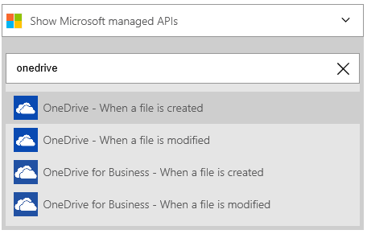
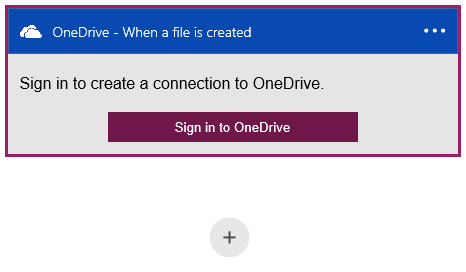
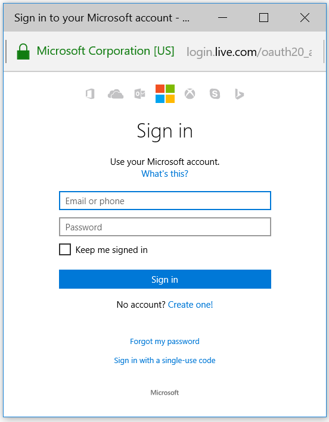
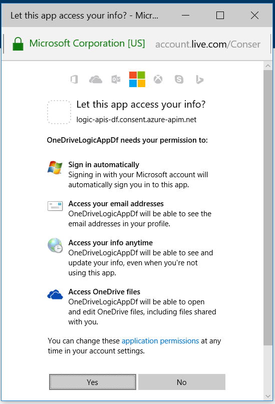
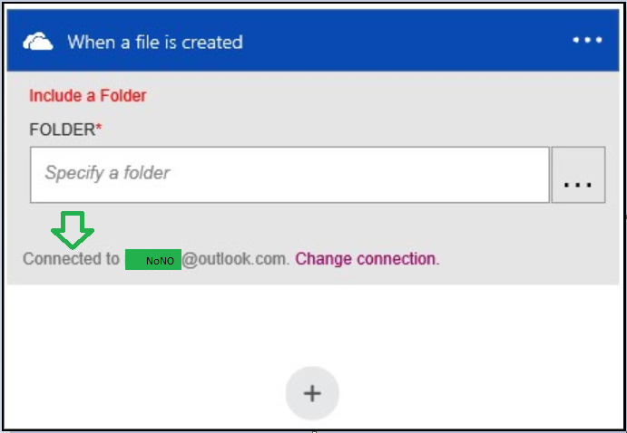

### Prerequisites
- A [OneDrive](http://OneDrive.com) account 

Before you can use your OneDrive account in a Logic app, you must authorize the Logic app to connect to your OneDrive account. Fortunately, you can do this easily from within your Logic app on the Azure Portal. 

Here are the steps to authorize your Logic app to connect to your OneDrive account:

1. To create a connection to OneDrive, in the Logic app designer, select **Show Microsoft managed APIs** in the drop down list then enter *OneDrive* in the search box. Select the trigger or action you'll like to use:  
  
2. If you haven't created any connections to OneDrive before, you'll get prompted to provide your OneDrive credentials. These credentials will be used to authorize your Logic app to connect to, and access your OneDrive account's data:  
  
4. Provide your OneDrive user name and password to authorize your Logic app:  
     
3. Allow us to connect to OneDrive:  
     
5. Notice the connection has been created and you are now free to proceed with the other steps in your Logic app:  
  
